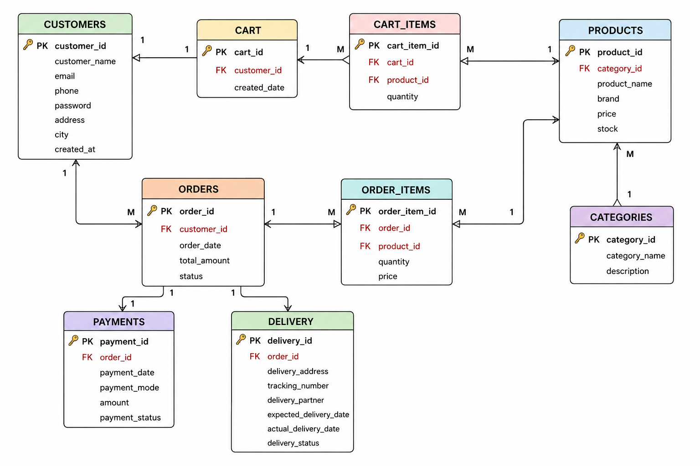

# E-Commerce Database Management System

## Project Overview

The E-Commerce Database Management System is a relational database designed using MySQL to manage the core operations of an online shopping platform. The database maintains information related to customers, products, categories, shopping carts, orders, payments, and deliveries while ensuring data integrity through primary and foreign key constraints.

This project demonstrates database design, normalization, relationship modeling, and SQL query implementation for real-world e-commerce operations.

---

## Technologies Used

- MySQL
- SQL
- MySQL Command Line (CMD)

---

## Features

- Customer Management
- Product Management
- Category Management
- Shopping Cart Management
- Order Processing
- Payment Management
- Delivery Tracking
- Relational Database Design
- Data Integrity using Primary and Foreign Keys
- SQL Queries using Joins, Aggregate Functions, Group By, and Subqueries

---

## Database Tables

| Table | Description |
|--------|-------------|
| Customers | Stores customer information |
| Categories | Stores product categories |
| Products | Stores product details |
| Cart | Stores customer shopping carts |
| Cart_Items | Stores products added to shopping carts |
| Orders | Stores customer order details |
| Order_Items | Stores products included in each order |
| Payments | Stores payment information |
| Delivery | Stores delivery details |

---

## Entity Relationship Diagram

The following ER Diagram illustrates the relationships between all tables in the database.



---

## Repository Structure

```
E-Commerce-Database-Management-System/
│
├── README.md
├── schema.sql
├── insert_data.sql
├── queries.sql
└── ER_Diagram.png
```

---

## Installation

1. Clone the repository.

```bash
git clone https://github.com/saranyareddy03/E-Commerce-Database-Management-System.git
```

2. Open MySQL.

3. Execute the database schema.

```sql
SOURCE schema.sql;
```

4. Insert the sample data.

```sql
SOURCE insert_data.sql;
```

5. Execute the SQL queries available in `queries.sql`.

---

## SQL Concepts Implemented

- DDL Commands
- DML Commands
- Primary Keys
- Foreign Keys
- Constraints
- Joins
- Aggregate Functions
- GROUP BY
- ORDER BY
- Subqueries

---

## Learning Outcomes

- Designed a normalized relational database for an e-commerce platform.
- Established relationships using primary and foreign keys.
- Implemented SQL queries for data retrieval and reporting.
- Applied normalization principles to minimize redundancy.
- Managed customer orders, payments, and delivery information efficiently.

---

## Author

**Nallimilli Saranya Reddy**

GitHub: https://github.com/saranyareddy03
